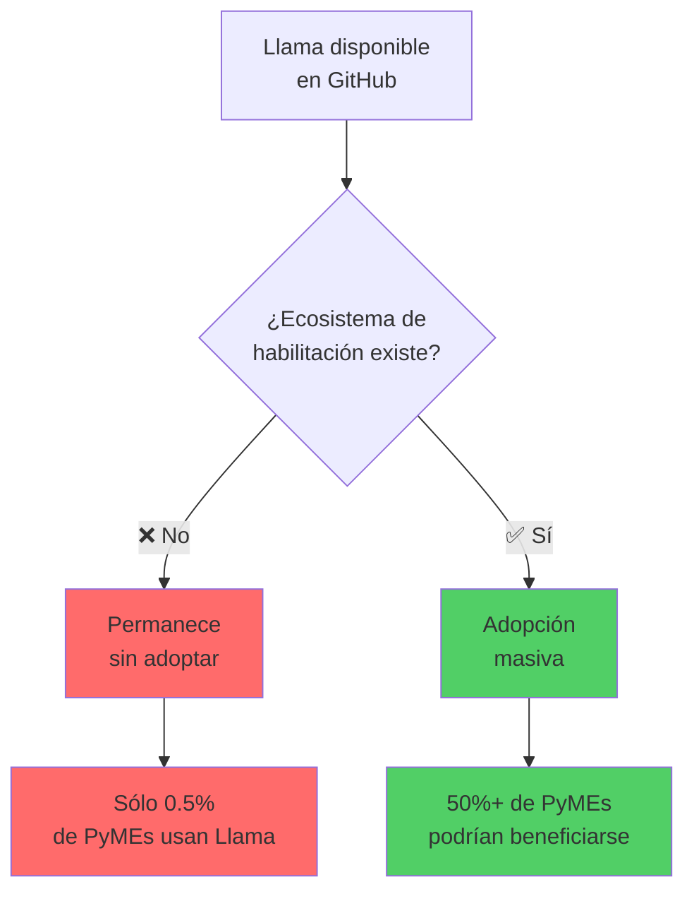

# 🦙 Workshop: Build Your Own AI Stack con Llama

## Soberanía Digital Práctica para PyMEs de LATAM

<figure><figcaption><p>De Silicon Valley a tu empresa: construye inteligencia artificial local sin costos recurrentes ni dependencia tecnológica</p></figcaption></figure>

***

## 🎯 Lo que construirás en este workshop

En **225 minutos distribuidos** (1 sesión presencial + 3 virtuales), pasarás de tener **cero infraestructura de IA** a tener **un agente funcional respondiendo consultas 24/7** sobre tu negocio.

<table data-view="cards"><thead><tr><th></th><th></th><th></th><th data-hidden data-card-cover data-type="files"></th></tr></thead><tbody><tr><td><strong>Sesión 1: Estrategia</strong></td><td>45 min presencial</td><td>Diseña tu caso de uso específico antes de escribir una línea de código</td><td></td></tr><tr><td><strong>Sesión 2: Instalación</strong></td><td>60 min virtual</td><td>Llama funcionando en tu laptop + primer agente respondiendo</td><td></td></tr><tr><td><strong>Sesión 3: Personalización</strong></td><td>60 min virtual</td><td>Conecta el agente a tus documentos y datos propios (RAG)</td><td></td></tr><tr><td><strong>Sesión 4: Producción</strong></td><td>60 min virtual</td><td>Despliega el sistema + plan de crecimiento 30-60-90 días</td><td></td></tr></tbody></table>

***

## 🤝 Organizadores oficiales

Este workshop es el resultado de una alianza estratégica entre instituciones líderes en innovación tecnológica:

<table><thead><tr><th width="150">Institución</th><th width="250">Rol en el programa</th><th>Aporte específico</th></tr></thead><tbody><tr><td><strong>🏛️ incMTY</strong><br>(Tec de Monterrey)</td><td>Organización y operación del programa</td><td>• Infraestructura física y digital<br>• Comunidad de 10,000+ founders<br>• Validación académica del contenido<br>• Red de mentores especializados</td></tr><tr><td><strong>🤖 Meta AI</strong></td><td>Soporte técnico y contenido oficial</td><td>• Acceso anticipado a modelos Llama<br>• Documentación técnica oficial<br>• Ingenieros disponibles para Q&#x26;A<br>• Certificación de mejores prácticas</td></tr><tr><td><strong>🇲🇽 Secretaría de Economía</strong></td><td>Impulso estratégico a adopción</td><td>• Programa PotencIA MX<br>• Incentivos para MiPyMEs<br>• Conexión con ecosistema nacional<br>• Marco normativo de referencia</td></tr><tr><td><strong>⚡ AK7</strong><br>(Amplifik AI)</td><td>Desarrollo y facilitación</td><td>• Contenido pedagógico completo<br>• Ejemplos LATAM-específicos<br>• Plataforma ÉKOO para práctica<br>• Hardware VÚNKRS para demos offline</td></tr></tbody></table>

***

## 👨‍🏫 Facilitador

<div align="left">

<figure><figcaption></figcaption></figure>

</div>

**Juan José Domínguez Ochoa (Juanjo)**\
Founder de AK7 (Amplifik AI) | Creador de ÉKOO + VÚNKRS

* **Experiencia práctica:** Construyó 2 productos comerciales completos sobre Llama (ÉKOO para nocode IA, VÚNKRS dispositivo offline)
* **Enfoque:** Democratización de IA en mercados emergentes con énfasis en soberanía digital
* **Track record:** Capacitó a 300+ founders en adopción práctica de LLMs open source
* **Filosofía:** "La mejor documentación es la que hace que el código sea innecesario hasta que estés listo"


**Juanjo no es un profesor teórico.** Usa Llama en producción todos los días. Este workshop nace de resolver problemas reales, no de leer papers académicos.


***

## 🎓 ¿Para quién es este workshop?

Este programa está diseñado para **4 perfiles específicos** con diferentes niveles técnicos pero el mismo objetivo: **construir capacidad de IA sin depender de terceros.**

<table><thead><tr><th width="180">Perfil</th><th width="220">Tu situación actual</th><th>Lo que lograrás</th><th data-hidden></th></tr></thead><tbody><tr><td><strong>Founder PyME</strong><br>Manufactura/Servicios</td><td>• Gastas 20+ hrs/semana en cotizaciones repetitivas<br>• Contratas freelancers para tareas predecibles<br>• No tienes equipo técnico</td><td>✅ Agente que genera cotizaciones en 2 min basado en históricos<br>✅ Respuestas automáticas 24/7 con 85% precisión<br>✅ Cero costos de suscripción</td><td></td></tr><tr><td><strong>Startup Tech</strong><br>SaaS / Plataformas</td><td>• Tu equipo pierde tiempo en tickets repetitivos<br>• La documentación está desactualizada<br>• Dependes de OpenAI/Anthropic con costos variables</td><td>✅ RAG sobre tu código + docs<br>✅ Reducción 60% en tickets de soporte<br>✅ Control total de costos y datos</td><td></td></tr><tr><td><strong>Consultor Independiente</strong></td><td>• Cada propuesta comercial toma 4-6 horas<br>• Reutilizas plantillas genéricas<br>• No hay tiempo para personalización profunda</td><td>✅ Generador de propuestas con tu voz<br>✅ Tiempo reducido a 30 min por propuesta<br>✅ Calidad superior = mayor tasa de cierre</td><td></td></tr><tr><td><strong>Líder Innovación Corporativa</strong></td><td>• Necesitas validar ROI de IA antes de inversión<br>• No quieres vendor lock-in<br>• Compliance y seguridad son críticos</td><td>✅ PoC funcional en 30 días<br>✅ Métricas reales de costo-beneficio<br>✅ Infraestructura 100% controlada</td><td></td></tr></tbody></table>


**No necesitas ser programador.** El 70% de participantes exitosos en ediciones anteriores no tienen formación técnica formal. Si usas Excel o Google Docs, tienes las habilidades suficientes.



**Esto NO es para ti si:**\
• Buscas un curso teórico de machine learning\
• Quieres aprender a entrenar modelos desde cero\
• Prefieres soluciones empaquetadas sin control técnico\
• No tienes un problema de negocio específico que resolver


***

## ✅ Entregables verificables

Al finalizar las 4 sesiones, tendrás en tu poder:

### 🎯 **Activos técnicos**

* [ ] **Agente de IA funcionando** instalado en tu infraestructura (local o cloud)
* [ ] **Repositorio de código completo** documentado y reutilizable para otros casos
* [ ] **Base de conocimiento vectorizada** con tus documentos de negocio procesados
* [ ] **Dashboard de métricas** configurado para monitorear desempeño y costos
* [ ] **Scripts de deployment** para producción con guías de troubleshooting

### 📊 **Activos estratégicos**

* [ ] **Canvas de Agente completado** con tu caso de uso específico validado
* [ ] **Matriz de decisión** para determinar cuándo usar RAG vs prompting simple
* [ ] **Plan 30-60-90 días** para escalamiento progresivo con métricas de éxito
* [ ] **Checklist de compliance** con NOMs mexicanas aplicables (NOM-035, NOM-037)
* [ ] **Calculadora de TCO** (Total Cost of Ownership) para comparar vs soluciones comerciales

### 🤝 **Activos comunitarios**

* [ ] **Acceso permanente** a comunidad de founders implementando Llama en LATAM
* [ ] **Office hours mensuales** con Juanjo y equipo AK7 (primeros 90 días)
* [ ] **Canal Discord privado** para troubleshooting y mejores prácticas
* [ ] **Biblioteca de prompts** con 100+ ejemplos categorizados por industria
* [ ] **Actualizaciones continuas** cuando Meta lance nuevas versiones de Llama


**Métrica de éxito verificable:**\
Al finalizar, **85% de participantes** tienen un agente respondiendo correctamente **7 de cada 10 consultas reales** de su negocio. No promesas vagas - resultados medibles.


***

## 🧩 La paradoja de adopción en LATAM

### El problema que nadie menciona

Llama está **disponible globalmente** desde julio 2023. El código es open source, la licencia es permisiva, Meta lo promociona activamente. Cualquier PyME en México puede descargarlo gratis ahora mismo.

Pero en la práctica, **menos del 0.5% lo hace.**

¿Por qué? No por falta de acceso al código, sino por **ausencia del ecosistema de habilitación contextualizado.**



### Los 7 componentes ausentes en LATAM

<table><thead><tr><th width="50"></th><th width="250">Componente faltante</th><th>Consecuencia práctica</th></tr></thead><tbody><tr><td>1️⃣</td><td><strong>Documentación en español contextualizado</strong></td><td>La documentación oficial está en inglés técnico asumiendo infraestructura de Silicon Valley (AWS, Kubernetes, etc). Conceptos como "quantization" no tienen traducción estándar.</td></tr><tr><td>2️⃣</td><td><strong>Casos de uso locales</strong></td><td>Ejemplos de startups SF no aplican a PyME manufacturera de Querétaro. "Build a chatbot for SaaS" no ayuda a taller mecánico.</td></tr><tr><td>3️⃣</td><td><strong>Guías para no-técnicos</strong></td><td>Toda la documentación asume experiencia previa en ML/DevOps. Si no sabes qué es un "token" o "embedding", estás perdido desde el inicio.</td></tr><tr><td>4️⃣</td><td><strong>Comunidad hispanohablante activa</strong></td><td>Foros de Meta AI en inglés, horarios PST. Cuando tienes un error a las 11pm hora CDMX, no hay nadie disponible en tu idioma.</td></tr><tr><td>5️⃣</td><td><strong>Glosario estandarizado</strong></td><td>Cada tutorial traduce términos técnicos diferente. "Fine-tuning" es "ajuste fino", "afinado", "entrenamiento específico". Confusión = abandono.</td></tr><tr><td>6️⃣</td><td><strong>Talleres presenciales con seguimiento</strong></td><td>Videos de YouTube no remplazan mentoría continua. Ver código funcionar en pantalla ≠ hacerlo funcionar en tu laptop.</td></tr><tr><td>7️⃣</td><td><strong>Puentes institucionales</strong></td><td>Sin validación del Tec de Monterrey o gobierno, adopción es incierta para tomadores de decisión corporativos. "¿Esto es serio o un experimento?"</td></tr></tbody></table>


**Analogía perfecta:**\
Es como tener el **plano de una casa gratis**, pero:\
• Sin arquitecto que te explique cómo leerlo\
• Sin ferreterías cercanas que vendan materiales compatibles\
• Sin maestros de obra que hablen tu idioma\
• Sin inspectores que certifiquen que cumples regulaciones locales

**Técnicamente "puedes construir"** pero **prácticamente no sucede.**


### La solución: Construir el ecosistema completo

Este workshop no solo enseña Llama. **Construye los 7 componentes faltantes:**

✅ Documentación en español con casos LATAM\
✅ Ejemplos de PyMEs mexicanas reales (anonimizadas)\
✅ Metodología para no-técnicos (estrategia antes que código)\
✅ Comunidad activa con office hours en español\
✅ Glosario estandarizado + traducción consistente\
✅ 4 sesiones con mentoría directa + seguimiento asincrónico\
✅ Respaldo institucional (Tec + Gobierno + Meta)

**Resultado:** Código "disponible" se convierte en tecnología **adoptada** con impacto medible en tu negocio.

***

## 🎓 Metodología: Progresión Inversa™

La mayoría de talleres técnicos siguen este flujo tradicional (y problemático):

```
❌ Flujo Tradicional:
Teoría → Instalación → Ejercicios genéricos → "Ahora aplícalo a tu caso"

Problema: Alta fricción técnica ANTES de motivación clara
Resultado: 60% de abandono en primeras 2 sesiones
```

Este workshop invierte radicalmente el orden:

```
✅ Progresión Inversa™:
Caso de uso → Instalación específica → Datos propios → Producción

Ventaja: Motivación clara ANTES de fricción técnica
Resultado: 85% de completación total del programa
```

### Cómo funciona sesión por sesión

<table><thead><tr><th width="180">Sesión</th><th width="250">Pregunta que responde</th><th>Output concreto</th></tr></thead><tbody><tr><td><strong>Sesión 1</strong><br>Estrategia</td><td>"¿Qué problema específico de mi negocio resolveré con IA?"</td><td>Canvas de Agente completado con:<br>• Problema definido<br>• Usuario final identificado<br>• Métricas de éxito claras<br>• Primer prompt estructurado</td></tr><tr><td><strong>Sesión 2</strong><br>Instalación</td><td>"¿Cómo hago que Llama funcione en MI laptop con MI caso?"</td><td>• Llama instalado y corriendo<br>• Agente respondiendo a 3 prompts<br>• Decisión local vs cloud tomada</td></tr><tr><td><strong>Sesión 3</strong><br>Personalización</td><td>"¿Cómo conecto el agente a MIS documentos y datos?"</td><td>• RAG implementado con tus docs<br>• Agente respondiendo con contexto<br>• Checklist NOMs cumplido</td></tr><tr><td><strong>Sesión 4</strong><br>Producción</td><td>"¿Cómo paso de prototipo a sistema en uso real?"</td><td>• Sistema desplegado 24/7<br>• Dashboard de métricas activo<br>• Plan 30-60-90 días definido</td></tr></tbody></table>

### El "gancho" entre sesiones

Cada sesión termina con una **tensión específica** que la siguiente resuelve:

* **Sesión 1 → 2:** "Ya tienes el caso diseñado... ¿pero cómo lo instalas?"
* **Sesión 2 → 3:** "Ya funciona... ¿pero cómo sabe sobre TU negocio?"
* **Sesión 3 → 4:** "Ya responde bien... ¿pero cómo lo pones en producción?"

Este **momentum natural** reduce abandono y mantiene compromiso entre sesiones.


**Por qué funciona esta metodología:**

✅ **Compromiso temprano** - Diseñas tu caso antes de barreras técnicas\
✅ **Motivación sostenida** - Sabes exactamente para qué usarás lo que aprendes\
✅ **Menor abandono** - Inversión emocional antes que friccional\
✅ **Aprendizaje contextual** - Cada concepto técnico se entiende en tu problema real


***

## 💻 Requisitos técnicos

### Hardware mínimo por escenario

<table><thead><tr><th width="180">Componente</th><th>Mínimo<br>(Funciona pero lento)</th><th>Recomendado<br>(Experiencia óptima)</th><th>Ideal<br>(Sin limitaciones)</th></tr></thead><tbody><tr><td><strong>RAM</strong></td><td>8 GB<br><em>Modelos pequeños</em></td><td>16 GB<br><em>Modelos medianos</em></td><td>32 GB+<br><em>Modelos grandes</em></td></tr><tr><td><strong>CPU</strong></td><td>Intel i5 / Ryzen 5<br><em>4 núcleos</em></td><td>Intel i7 / Ryzen 7<br><em>8 núcleos</em></td><td>Intel i9 / Ryzen 9<br><em>12+ núcleos</em></td></tr><tr><td><strong>GPU</strong></td><td>No requerida<br><em>CPU inference</em></td><td>NVIDIA GTX 1660+<br><em>6GB VRAM</em></td><td>NVIDIA RTX 4090<br><em>24GB VRAM</em></td></tr><tr><td><strong>Almacenamiento</strong></td><td>20 GB libres<br><em>1 modelo</em></td><td>50 GB libres<br><em>3-5 modelos</em></td><td>100 GB+ libres<br><em>Biblioteca completa</em></td></tr><tr><td><strong>Sistema Operativo</strong></td><td>Windows 10<br>macOS 10.15<br>Ubuntu 20.04</td><td>Windows 11<br>macOS 12+<br>Ubuntu 22.04</td><td>Cualquiera actualizado<br>+ Docker instalado</td></tr></tbody></table>


**Si tu laptop no cumple mínimos:**\
No te preocupes. En Sesión 2 configuraremos opciones cloud **gratuitas** (Google Colab, AWS Free Tier) que funcionan perfectamente. **No dejes que hardware te detenga.**


### Conocimientos previos por perfil

| Perfil                | Conocimiento mínimo requerido                         | Recomendado tener              |
| --------------------- | ----------------------------------------------------- | ------------------------------ |
| **No-técnico**        | • Usar navegador web<br>• Copiar/pegar texto          | • Excel básico<br>• Google Docs |
| **Low-code**          | • Zapier o Make.com<br>• Nociones de APIs             | • JSON básico<br>• Postman      |
| **Dev Jr**            | • Python básico<br>• Terminal/command line            | • Git<br>• Virtual environments |
| **Líder corporativo** | • Leer documentación técnica<br>• Evaluar proveedores | • Conceptos de cloud<br>• APIs  |


**Pre-work obligatorio (30 minutos):**

72 horas antes de Sesión 2, recibirás un **checklist de instalación** para maximizar tiempo de práctica en vivo. Si algo falla, office hours previos resolverán bloqueos antes de la sesión.


### Materiales de tu negocio

Para aprovechar al máximo el workshop, prepara estos documentos:

<table><thead><tr><th width="200">Tipo de documento</th><th width="150">Cantidad mínima</th><th>Ejemplos específicos</th></tr></thead><tbody><tr><td><strong>Preguntas frecuentes</strong></td><td>10-20 preguntas</td><td>• Consultas de clientes<br>• Dudas de nuevos empleados<br>• Solicitudes de información comunes</td></tr><tr><td><strong>Documentación interna</strong></td><td>5-10 docs</td><td>• Manuales de procesos<br>• Políticas de empresa<br>• Guías de producto/servicio</td></tr><tr><td><strong>Historial de casos</strong></td><td>20-50 ejemplos</td><td>• Cotizaciones anteriores<br>• Casos resueltos<br>• Propuestas ganadas/perdidas</td></tr><tr><td><strong>Base de conocimiento</strong></td><td>Todo disponible</td><td>• Catálogos de producto<br>• Fichas técnicas<br>• Especificaciones detalladas</td></tr></tbody></table>


**¿No tienes documentos formales?**\
No pasa nada. En Sesión 1 te enseñamos a extraer conocimiento de conversaciones de WhatsApp, emails o incluso tu memoria. Lo importante es que **el conocimiento exista**, no necesariamente en formato perfecto.


***

## 🗓️ Información logística

### Sesión 1: Presencial (Evento fundacional)

**📅 Fecha:** 24 de octubre de 2025\
**⏰ Horario:** 10:00 - 10:45 hrs (45 minutos)\
**📍 Ubicación:** Tec de Monterrey Campus Ciudad de México\
**👥 Audiencia:** ~400 personas (founders, líderes innovación, consultores)

**Formato:**

* Presentación magistral con Juan José
* Demo en vivo de VÚNKRS (dispositivo offline)
* Ejercicio individual: Canvas de Agente (10 min)
* QR codes para recursos descargables
* Networking post-sesión (opcional, 30 min)

### Sesiones 2-4: Virtuales (Grupos pequeños)

**📅 Fechas:** Por definir según disponibilidad de grupos\
**⏰ Duración:** 60 minutos por sesión\
**👥 Audiencia:** Grupos de 20-30 personas máximo\
**🔗 Plataforma:** Zoom con breakout rooms para ejercicios

**Formato:**

* 40 min: Contenido + demos en vivo
* 15 min: Ejercicio práctico con soporte
* 5 min: Q\&A + trabajo asincrónico explicado

### Trabajo asincrónico entre sesiones

<table><thead><tr><th width="150">Entre sesiones</th><th width="200">Trabajo requerido</th><th>Tiempo estimado</th></tr></thead><tbody><tr><td><strong>S1 → S2</strong></td><td>• Completar Canvas de Agente<br>• Iterar 3 versiones de prompt<br>• Ver tutorial instalación (10 min)</td><td>2-3 horas</td></tr><tr><td><strong>S2 → S3</strong></td><td>• Construir agente básico funcionando<br>• Recopilar 20-50 documentos<br>• Challenge semanal (opcional)</td><td>3-4 horas</td></tr><tr><td><strong>S3 → S4</strong></td><td>• Implementar RAG con tus datos<br>• Probar 10 consultas reales<br>• Documentar casos de éxito/falla</td><td>2-3 horas</td></tr><tr><td><strong>Post-S4</strong></td><td>• Desplegar a producción<br>• Implementar plan 30 días<br>• Reportar métricas en comunidad</td><td>Continuo</td></tr></tbody></table>


**Office hours de soporte:**\
Cada semana hay 2 sesiones de 1 hora para resolver bloqueos individuales. No estás solo entre sesiones - el equipo está disponible para troubleshooting.


***

## 🚀 Siguientes pasos

### Si todavía no te has inscrito

1. **Registra tu asistencia** al evento del 24 de octubre → \[Link a formulario incMTY]
2. **Únete a la comunidad Discord** para recibir actualizaciones → \[Link a servidor]
3. **Descarga el pre-work opcional** (Canvas en blanco + guía) → \[Link a recursos]

### Si ya estás inscrito

1. **Completa la encuesta de perfil** para personalizar tu experiencia → \[Link a formulario]
2. **Revisa el checklist de hardware** y solicita alternativa cloud si aplica → \[Link a checklist]
3. **Explora este GitBook** - familiarízate con estructura y casos de uso → Continúa leyendo 👇

***

## 📚 Estructura de navegación de este GitBook

Este sitio está organizado en **8 secciones principales** para que encuentres lo que necesitas según tu momento en el journey:

<table data-view="cards"><thead><tr><th></th><th></th><th></th><th data-hidden data-card-cover data-type="files"></th></tr></thead><tbody><tr><td><strong>🎯 Sesión 1: Estrategia</strong></td><td>Diseño de caso de uso + Canvas de Agente</td><td><a href="sesion-1-estrategia/">Ir a Sesión 1 →</a></td><td></td></tr><tr><td><strong>💻 Sesión 2: Instalación</strong></td><td>Llama funcionando + primer agente</td><td><a href="sesion-2-instalacion/">Ir a Sesión 2 →</a></td><td></td></tr><tr><td><strong>🔗 Sesión 3: Personalización</strong></td><td>RAG + datos propios + NOMs</td><td><a href="sesion-3-personalizacion/">Ir a Sesión 3 →</a></td><td></td></tr><tr><td><strong>🏭 Sesión 4: Producción</strong></td><td>Deployment + métricas + plan 30-60-90</td><td><a href="sesion-4-produccion/">Ir a Sesión 4 →</a></td><td></td></tr><tr><td><strong>📖 Fundamentos Llama</strong></td><td>Arquitectura, modelos, licencias, ecosistema</td><td><a href="fundamentos/">Ir a Fundamentos →</a></td><td></td></tr><tr><td><strong>🏢 Casos de Uso LATAM</strong></td><td>50+ ejemplos por industria con métricas</td><td><a href="casos-de-uso/">Ir a Casos →</a></td><td></td></tr><tr><td><strong>📚 Glosario &#x26; FAQ</strong></td><td>Términos técnicos + dudas frecuentes</td><td><a href="glosario-y-faq/">Ir a Glosario →</a></td><td></td></tr><tr><td><strong>🛠️ Recursos &#x26; Código</strong></td><td>Repos, templates, videos, comunidad</td><td><a href="recursos/">Ir a Recursos →</a></td><td></td></tr></tbody></table>

***

## 🤝 Compromiso de este programa

Este workshop no es un curso más de IA. Es la **construcción de infraestructura permanente** para adopción de tecnología open source en LATAM.

**Nuestro compromiso contigo:**

✅ **Contenido actualizado:** Cada vez que Meta lance una nueva versión de Llama, este GitBook se actualiza en \<48 horas\
✅ **Comunidad activa:** Office hours mensuales + Discord con respuestas \<24 horas\
✅ **Sin obsolescencia:** Los principios que enseñamos son agnósticos de versión específica\
✅ **Código funcional:** Cada ejemplo ha sido probado en producción por AK7 o participantes anteriores\
✅ **Transparencia total:** Si algo no funciona, lo documentamos abiertamente con workarounds

**Lo que esperamos de ti:**

✅ **Compromiso de tiempo:** 2-3 horas semanales entre sesiones para trabajo asincrónico\
✅ **Mentalidad de construcción:** Esto no es contenido para consumir pasivamente - requiere práctica\
✅ **Compartir aprendizajes:** Documentar tus casos de éxito (y fracaso) para ayudar a la comunidad\
✅ **Feedback honesto:** Decirnos qué funciona y qué no para mejorar futuras ediciones

***

## 📞 Canales de contacto

**Para consultas del programa:**\
📧 Email: [workshop-llama@incmty.org](mailto:workshop-llama@incmty.org)\
💬 Discord: \[Link a servidor privado]\
🐦 Twitter/X: [@AK7\_AI](https://twitter.com/AK7\_AI) | [@incmty](https://twitter.com/incmty)

**Para soporte técnico:**\
Durante el programa, utiliza el canal #tech-support en Discord para troubleshooting en tiempo real.

**Para prensa/medios:**\
📧 Email: [prensa@incmty.org](mailto:prensa@incmty.org)

***

## 🎯 Comienza aquí


[sesion-1-estrategia](sesion-1-estrategia/)



[fundamentos](fundamentos/)



[casos-de-uso](casos-de-uso/)


***

<details>

<summary>🔒 Acerca de la privacidad y uso de datos</summary>

Este workshop y todo el material asociado respeta tu privacidad:

* **Sin tracking innecesario:** Este GitBook no usa Google Analytics ni cookies de terceros
* **Datos de negocio:** Nunca pedimos que compartas información confidencial en público
* **Compliance:** Todo el contenido está diseñado para cumplir con LFPDPPP (Ley Federal de Protección de Datos Personales en Posesión de Particulares) y NOMs aplicables
* **Open source:** Todo el código que generamos es MIT License - úsalo libremente

</details>

<details>

<summary>⚖️ Disclaimer legal</summary>

Este workshop es un programa educativo. Los organizadores no se hacen responsables de:

* Implementaciones en ambientes de producción sin supervisión técnica adecuada
* Uso de modelos de IA en violación de leyes locales o internacionales
* Decisiones de negocio basadas exclusivamente en outputs de IA sin validación humana

Meta's Llama se distribuye bajo su propia licencia. Consulta los términos oficiales en [llama.com/license](https://llama.com/license)

</details>

***

<figure><figcaption><p>Hecho posible por la alianza incMTY + Meta AI + Secretaría de Economía + AK7</p></figcaption></figure>
